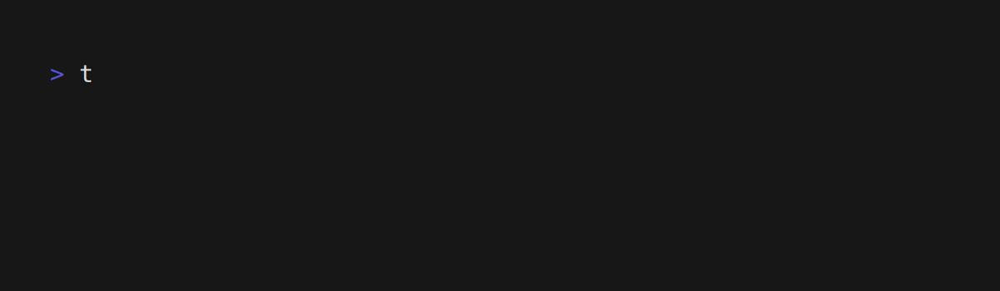

# Toffu

[](https://lbesson.mit-license.org/)

Toffu is a command-line interface (CLI) tool that enables users to manage their work schedule presence in [Woffu](https://www.woffu.com) directly from the terminal. With Toffu, users can conveniently interact with their Woffu account without the need to access the Woffu web interface.


<p align="center">
  <a href="#installation">Installation</a> •
  <a href="#usage">Usage</a> •
  <a href="#useful-links">Useful Links</a> •
  <a href="#license">License</a>
</p>

## Installation

### GNU/Linux or macOS

Via [Homebrew](https://brew.sh/):

```shell
brew install madh93/tap/toffu
```

### Windows

Via [Scoop](https://scoop.sh/):

```shell
scoop bucket add madh93 https://github.com/madh93/scoop-bucket.git
scoop install toffu
```

### From releases

Stable binaries for all platforms are available on the [releases page](https://github.com/Madh93/toffu/releases). To install, download the binary for your platform from "Assets", extract the downloaded file and place `toffu` into your `PATH`:

```shell
curl -L https://github.com/Madh93/toffu/releases/latest/download/toffu_$(uname -s)_$(uname -m).tar.gz | tar -xz -O toffu > /usr/local/bin/toffu
chmod +x /usr/local/bin/toffu
```

### Go

If you have Go installed:

```shell
go install github.com/Madh93/toffu@latest
```

### From source

Install Go if it is not already installed. You can download it from the official [website](https://golang.org/dl).

Clone the `toffu` repository to build and install the binary:

```shell
git clone https://github.com/Madh93/toffu && cd toffu && make install
```

## Usage

```shell
Toffu is a simple CLI to manage presence in Woffu from your terminal

Usage:
  toffu [flags]
  toffu [command]

Available Commands:
  completion  Generate the autocompletion script for the specified shell
  help        Help about any command
  in          On-demand clock-in
  out         On-demand clock-out
  status      Show current status
  token       Generate API token (Required the first time)

Flags:
  -c, --config string      config file for toffu
  -d, --debug              enable debug mode
  -h, --help               help for toffu
  -v, --version            version for toffu

Use "toffu [command] --help" for more information about a command.
```

### Generate a token

Before using Toffu, an API token needs to be generated for authentication. Keep in mind that the token expires after three months. After this time, you will need to generate a new token:


### Clock in

Start to work:


### Clock out

Check out or take a pause:


### Get status

Display the current work schedule status:



## Useful Links

- [Woffu](https://www.woffu.com)
- [Woffu API](https://woffu.com/es/api)

## License

This project is licensed under the [MIT license](LICENSE).
