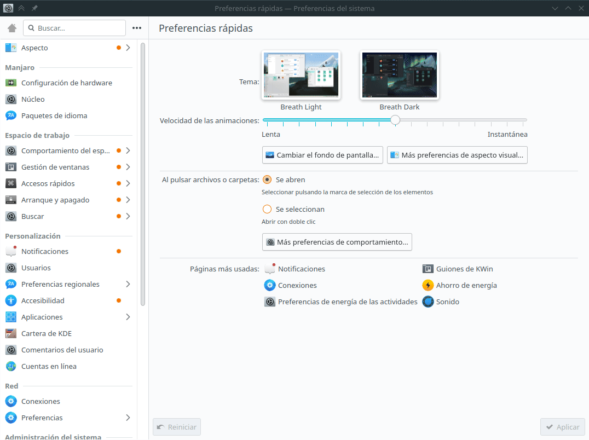

# Auto breaks

> This example is only for GNU/Linux users w/ KDE Plasma 5.

You can schedule automatic breaks or pauses by locking and unlocking the screen. In KDE Plasma 5, you can configure the screensaver to execute a custom script when any of these events occur. Please keep in mind that `toffu` considers the following:

- Whether you have manually clocked in already.
- Whether today is a workday.
- Whether you have worked the scheduled hours.

## Install Toffu

Check out the [installation instructions](../../README.md#installation) first.

## Setup

Open `System Settings`, there you can look for `Notifications` -> `Application Settings` -> `Screen Saver` -> `Configure Events`. Toggle the `Run command` for every state:

- **Screen unlocked**: `/usr/local/bin/toffu in`
- **Screen locked**: `/usr/local/bin/toffu out`

## Desktop notifications (optional)

You could also customize the previous commands to send desktop notifications using `notify-send`:

- **Screen unlocked**: `/usr/local/bin/toffu in && /usr/bin/notify-send -t 5 -a 'Toffu' 'You have clocked in sucessfully!' || /usr/bin/notify-send -t 0 -u critical -a 'Toffu' 'An error has ocurred while trying to clock in!'`
- **Screen locked**: `/usr/local/bin/toffu out && /usr/bin/notify-send -t 5 -a 'Toffu' 'You have clocked out sucessfully!' || /usr/bin/notify-send -t 0 -u critical -a 'Toffu' 'An error has ocurred while trying to clock out!'`
